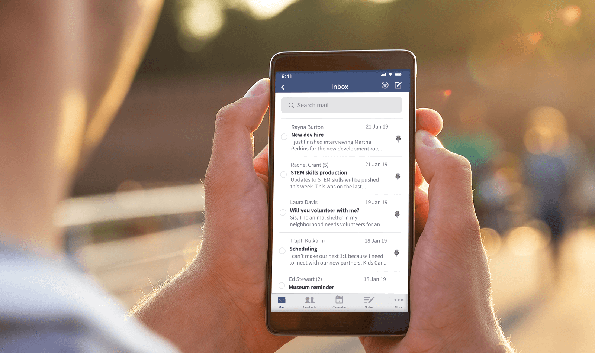

	

		<h1>Become a leader in  email innovation</h1>
		
JMAP is the developer-friendly, open standard for modern mail clients and applications.

		
<strong>It’s official!</strong> JMAP has been published by the Internet Engineering Task Force (IETF).

		<a href="spec.html" class="cta">See the specs</a>
	

	

		
	

